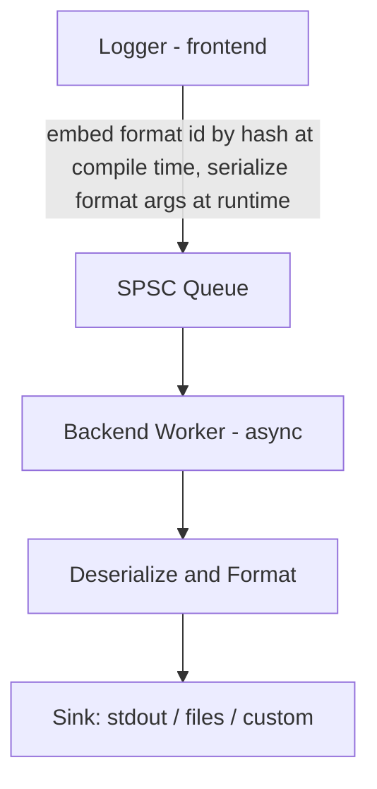

<h1 align=center>
  femtolog
</h1>

[](https://github.com/pugur523/femtolog/actions/workflows/ci.yml)
[](https://github.com/pugur523/femtolog/issues)
[](LICENSE)
[](https://isocpp.org/)
[](https://cmake.org/)
<br/>
[](README_ja.md)

> Ultra-Light, High-Performance Asynchronous Logger

## ☄ Overview

**femtolog** is a blazing-fast, minimal-overhead asynchronous logging library built for performance-critical applications. It leverages zero-cost abstractions, cache-aligned SPSC queues, and compile-time format string serialization.

Designed for modern C++ projects where every nanosecond counts.

---

## 📖 Table of Contents
- [☄ Overview](#-overview)
- [📖 Table of Contents](#-table-of-contents)
- [🚀 Features](#-features)
- [📦 Usage](#-usage)
- [🔄 Workflow](#-workflow)
- [📊 Benchmarks](#-benchmarks)
  - [System Environment](#system-environment)
    - [Literal without format](#literal-without-format)
    - [Format integer](#format-integer)
    - [Format multi integers](#format-multi-integers)
    - [Format string](#format-string)
    - [Format string view](#format-string-view)
    - [Format mixed](#format-mixed)
    - [Format large string](#format-large-string)
- [🔧 Installation](#-installation)
  - [Using CMake](#using-cmake)
- [🔌 Custom Sinks](#-custom-sinks)
  - [✨ Implement Your Own Sink](#-implement-your-own-sink)
- [🪪 License](#-license)
- [❤️ Credits](#-credits)


## 🚀 Features

- 🔧 Compile-time format string registration
- 🧵 True asynchronous logging pipeline
- 🎯 Zero dynamic memory allocations on the frontend
- 💾 Dedicated backend worker thread for formatting and output
- ⚡ Faster than `spdlog`, and `quill` in benchmark

---

## 📦 Usage

`femtolog` supports formatting messages using [fmtlib](https://github.com/fmtlib/fmt).

```cpp
#include "femtolog/femtolog.h"

int main() {
  // get thread local logger instance
  femtolog::Logger& logger = femtolog::Logger::logger();

  // initialize logger and register log sink
  logger.init();
  logger.register_sink<femtolog::StdoutSink<>>();
  logger.register_sink<femtolog::FileSink>();
  logger.register_sink<femtolog::JsonLinesSink<>>();
  logger.level("trace");

  // start the backend worker that dequeues logged entries
  logger.start_worker();

  std::string username = "pugur";
  float cpu_usage = 42.57;
  bool result = true;
  int error_code = -1;

  // log messages with compile-time interpreted format strings:
  logger.trace<"Hello {}\n">("World");
  logger.debug<"Hello World wo formatting\n">();
  logger.info<"User \"{}\" logged in.\n">(username);
  logger.warn<"CPU usage is high: {}%\n">(cpu_usage);
  logger.error<"Return value is: {}\n">(result);

  logger.fatal<"Fatal error occured; error code: {}\n">(error_code);

  logger.stop_worker();
  logger.clear_sinks();

  return 0;
}
```

## 🔄 Workflow

The logging pipeline consists of a frontend (thread-local logger) and a backend (worker thread):

Format string literals (`"..."`) are hashed at compile time into a `format_id`. Arguments are serialized as a raw byte stream and passed asynchronously from the frontend to the backend through an SPSC queue.




This architecture separates formatting from the hot path of logging, minimizing latency.

## 📊 Benchmarks

### System Environment
- **OS**: Ubuntu 22.04 x86_64 
- **CPU**: Intel Core i3 12100 @ 4.3GHz
- **RAM**: DDR4 3600MHz 64GB

The following benchmark results were measured using [Google Benchmark](https://github.com/google/benchmark) with Clang-20 -O3 Release build on the above environment. For comparison, results of similar logging benchmarks using the following libraries are also shown:

- [**quill**](https://github.com/odygrd/quill)
- [**spdlog**](https://github.com/gabime/spdlog)

The benchmark codes are available in [`//src/bench/`](src/bench/) directory and the detail results of benchmark are archived in [`//src/bench/results/archive`](src/bench/results/archive/) directory.
Benchmarks are generated in the `//out/build/<platform>/<arch>/bin` directory by setting `FEMTOLOG_BUILD_BENCHMARK` to `true` when building with CMake.
After building, you can run the built benchmarks and collect results by executing `//src/build/scripts/run_bench.py` with the `--format` option. The results will be saved in the `//src/bench/results/` directory in both json and png formats.

#### Literal without format

|   Library    | 50%[ns] | 75%[ns] | 90%[ns] | 95%[ns] | 99%[ns] | 99.9%[ns] |
| :----------: | :-----: | :-----: | :-----: | :-----: | :-----: | :-------: |
| **femtolog** |  3.512  |  3.516  |  3.624  |  3.660  |  3.689  |   3.695   |
|    quill     | 22.873  | 23.911  | 25.149  | 25.562  | 25.892  |  25.967   |
|    spdlog    | 29.930  | 29.981  | 31.014  | 31.358  | 31.634  |  31.696   |

#### Format integer

|   Library    | 50%[ns] | 75%[ns] | 90%[ns] | 95%[ns] | 99%[ns] | 99.9%[ns] |
| :----------: | :-----: | :-----: | :-----: | :-----: | :-----: | :-------: |
| **femtolog** | 10.806  | 11.309  | 11.344  | 11.356  | 11.365  |  11.367   |
|    quill     | 23.872  | 23.934  | 24.552  | 24.758  | 24.923  |  24.960   |
|    spdlog    | 46.295  | 46.610  | 48.806  | 49.538  | 50.124  |  50.256   |

#### Format multi integers

|   Library    | 50%[ns] | 75%[ns] | 90%[ns] | 95%[ns] | 99%[ns] | 99.9%[ns] |
| :----------: | :-----: | :-----: | :-----: | :-----: | :-----: | :-------: |
| **femtolog** | 11.297  | 13.048  | 13.092  | 13.107  | 13.119  |  13.122   |
|    quill     | 24.175  | 24.310  | 24.848  | 25.027  | 25.171  |  25.203   |
|    spdlog    | 65.505  | 67.241  | 69.786  | 70.634  | 71.313  |  71.466   |

#### Format string

|   Library    | 50%[ns] | 75%[ns] | 90%[ns] | 95%[ns] | 99%[ns] | 99.9%[ns] |
| :----------: | :-----: | :-----: | :-----: | :-----: | :-----: | :-------: |
| **femtolog** | 13.591  | 14.059  | 14.387  | 14.496  | 14.583  |  14.603   |
|    quill     | 23.571  | 24.868  | 24.938  | 24.961  | 24.980  |  24.984   |
|    spdlog    | 49.125  | 50.731  | 50.755  | 50.763  | 50.769  |  50.771   |

#### Format string view

|   Library    | 50%[ns] | 75%[ns] | 90%[ns] | 95%[ns] | 99%[ns] | 99.9%[ns] |
| :----------: | :-----: | :-----: | :-----: | :-----: | :-----: | :-------: |
| **femtolog** | 11.867  | 11.928  | 12.045  | 12.085  | 12.116  |  12.123   |
|    quill     | 24.805  | 24.840  | 24.951  | 24.988  | 25.018  |  25.024   |
|    spdlog    | 46.054  | 49.631  | 54.423  | 56.020  | 57.297  |  57.585   |

#### Format mixed

|   Library    | 50%[ns] | 75%[ns] | 90%[ns] | 95%[ns] | 99%[ns] | 99.9%[ns] |
| :----------: | :-----: | :-----: | :-----: | :-----: | :-----: | :-------: |
| **femtolog** | 11.791  | 12.116  | 12.299  | 12.360  | 12.409  |  12.420   |
|    quill     | 23.330  | 26.236  | 26.258  | 26.266  | 26.272  |  26.273   |
|    spdlog    | 111.116 | 115.427 | 117.489 | 118.176 | 118.726 |  118.850  |

#### Format large string

|   Library    | 50%[ns] | 75%[ns] | 90%[ns] | 95%[ns] | 99%[ns] | 99.9%[ns] |
| :----------: | :-----: | :-----: | :-----: | :-----: | :-----: | :-------: |
| **femtolog** | 12.107  | 12.393  | 12.845  | 12.996  | 13.117  |  13.144   |
|    quill     | 22.043  | 22.193  | 22.893  | 23.126  | 23.313  |  23.355   |
|    spdlog    | 51.425  | 53.556  | 55.591  | 56.269  | 56.812  |  56.934   |

<div align=center>
  
</div>

## 🔧 Installation

### Using CMake

Add this repository as a git submodule:
```bash
git submodule add https://github.com/pugur523/femtolog.git ./femtolog --recursive
```

Add `femtolog` as a subdirectory:

```cmake
add_subdirectory(femtolog)

target_link_libraries(your_target PRIVATE femtolog)
```

To install the compiled library:
```cmake
set(INSTALL_FEMTOLOG TRUE)
set(FEMTOLOG_INSTALL_HEADERS TRUE)
add_subdirectory(femtolog)

target_link_libraries(your_target PRIVATE femtolog)
```

## 🔌 Custom Sinks
Need to log to a database, a network socket, or a ring buffer?

`femtolog` supports plug-and-play custom sinks via a simple interface:

### ✨ Implement Your Own Sink
To define a custom sink, just inherit from `SinkBase` and implement `on_log()`:
```cpp
#include "femtolog/sinks/sink_base.h"

class MySink : public femtolog::SinkBase {
 public:
  void on_log(const LogEntry& entry, const char* content, std::size_t len) override {
    // Write to file, send over network, etc.
    std::fwrite(content, 1, len, stderr);
  }
};
```
Then register your sink with the logger:
```cpp
logger.register_sink<MySink>();
```
That's it — your sink will now receive fully formatted log entries, asynchronously, from the backend.

## 🪪 License
`femtolog` is licensed under the [Apache 2.0 License](LICENSE).

## ❤️ Credits

- **[zlib](https://github.com/madler/zlib)**<br/>
  Used in `FileSink` and `JsonLinesSink` for compressing log files efficiently.
- **[GoogleTest (gtest)](https://github.com/google/googletest)**<br/>
  Serves as the primary unit testing framework for the entire project.
- **[Google Benchmark](https://github.com/google/benchmark)**<br/>
  Used to benchmark `femtolog` against other logging libraries to ensure high performance.
- **[fmtlib](https://github.com/fmtlib/fmt)**<br/>
  Powers the formatting engine behind all log message rendering.


Built with love by [pugur](https://github.com/pugur523).
