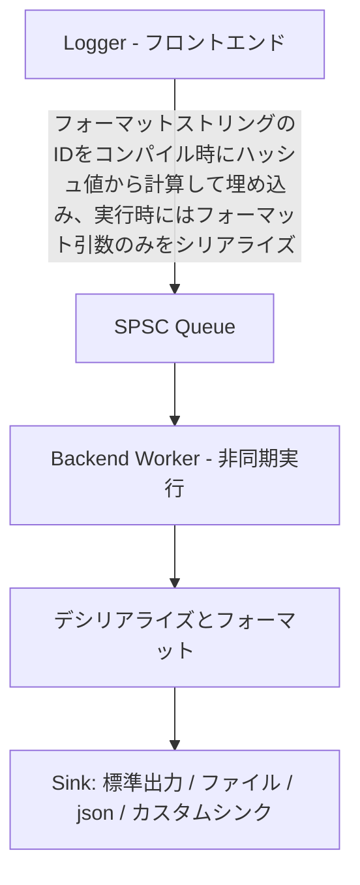

<h1 align=center>
  femtolog
</h1>

[](https://github.com/pugur523/femtolog/actions/workflows/ci.yml)
[](https://github.com/pugur523/femtolog/issues)
[](LICENSE)
[](https://isocpp.org/)
[](https://cmake.org/)
<br/>
[](README.md)

> 軽量で高性能な非同期logger

## ☄ 概要

**femtolog** は、パフォーマンス重視のアプリケーション向けに設計された、超高速・最小オーバーヘッドの非同期ロギングライブラリです。ゼロコスト抽象化、キャッシュアラインされたSPSCキュー、コンパイル時のフォーマット文字列シリアライズを活用しています。

ナノ秒単位のパフォーマンスが求められる最新のC++プロジェクト向けに設計されています。

---

## 📖 目次
- [☄ 概要](#-概要)
- [📖 目次](#-目次)
- [🚀 特徴](#-特徴)
- [📦 使い方](#-使い方)
- [🔄 ワークフロー](#-ワークフロー)
- [📊 ベンチマーク](#-ベンチマーク)
  - [システム環境](#システム環境)
    - [フォーマットなしリテラル文字列のログ](#フォーマットなしリテラル文字列のログ)
    - [intのフォーマットログ](#intのフォーマットログ)
    - [複数のintのフォーマットログ](#複数のintのフォーマットログ)
    - [std::stringのフォーマットログ](#stdstringのフォーマットログ)
    - [std::string\_viewのフォーマットログ](#stdstring_viewのフォーマットログ)
    - [型混在のフォーマットログ](#型混在のフォーマットログ)
    - [長い文字列のフォーマットログ](#長い文字列のフォーマットログ)
- [🔧 インストール](#-インストール)
  - [CMakeを使う場合](#cmakeを使う場合)
- [🔌 カスタムシンク](#-カスタムシンク)
  - [✨ 独自シンクの実装](#-独自シンクの実装)
- [🪪 ライセンス](#-ライセンス)
- [❤️ クレジット](#️-クレジット)


## 🚀 特徴

- 🔧 コンパイル時のフォーマット文字列登録
- 🧵 真の非同期ロギングパイプライン
- 🎯 フロントエンドでは動的メモリアロケーションゼロ
- 💾 フォーマットと出力専用のバックエンドワーカースレッド
- ⚡ ベンチマークで `spdlog` や `quill` より高速

---

## 📦 使い方

`femtolog` は [fmtlib](https://github.com/fmtlib/fmt) を使ったメッセージフォーマットに対応しています。

```cpp
#include "femtolog/femtolog.h"

int main() {
  // スレッドローカルなロガーインスタンスを取得
  femtolog::Logger& logger = femtolog::Logger::logger();

  // ロガーを初期化し、シンクを登録
  logger.init();
  logger.register_sink<femtolog::StdoutSink<>>();
  logger.register_sink<femtolog::FileSink<>>();
  logger.register_sink<femtolog::JsonLinesSink<>>();
  logger.level("trace");

  // ログエントリをデキューするバックエンドワーカーを起動
  logger.start_worker();

  std::string username = "pugur";
  float cpu_usage = 42.57;
  bool result = true;
  int error_code = -1;

  // コンパイル時解釈されるさォーマット文字列を使用しログ出力:
  logger.trace<"Hello {}\n">("World");
  logger.debug<"Hello World wo formatting\n">();
  logger.info<"User \"{}\" logged in.\n">(username);
  logger.warn<"CPU usage is high: {}%\n">(cpu_usage);
  logger.error<"Return value is: {}\n">(result);

  logger.fatal<"Fatal error occured; error code: {}\n">(error_code);

  logger.stop_worker();
  logger.clear_sinks();

  return 0;
}
```

## 🔄 ワークフロー

ロギングパイプラインはフロントエンド（スレッドローカルロガー）とバックエンド（ワーカースレッド）で構成されます。すべてのフロントエンドロガーインスタンスはそれに対応するバックエンドワーカーインスタンスを保持しており、これにより極限のフロントエンド側の低レイテンシを実現しています。

フォーマット文字列リテラル（`"..."`）はコンパイル時にあらかじめ`format_id`としてハッシュ値が計算されます。引数は生のバイト配列としてシリアライズされ、非同期でSPSC queueを通じてフロントエンドからバックエンドに渡されます。




この構造により、フォーマット処理をロギングのホットパスから分離し、レイテンシを最小化します。

## 📊 ベンチマーク

### システム環境
- **OS**: Ubuntu 22.04 x86_64 
- **CPU**: Intel Core i3 12100 @ 4.3GHz
- **RAM**: DDR4 3600MHz 64GB

以下のベンチマーク結果は [Google Benchmark](https://github.com/google/benchmark) を用い、Clang-21 -O3 Release buildを上記の環境で測定したものです。
比較のため、以下のライブラリを用いて同様のログを行うベンチマークの結果も示しています。

- [**quill**](https://github.com/odygrd/quill)
- [**spdlog**](https://github.com/gabime/spdlog)

使用したベンチマークコードは [`//src/bench/`](src/bench/) ディレクトリにて確認できます。また、ベンチマーク結果の詳細については[`//src/bench/results/archive/`](src/bench/results/archive/)ディレクトリにアーカイブしてあります。
ベンチマークはCMakeでビルド時に`FEMTOLOG_BUILD_BENCHMARK`を`true`に指定することで`//out/build/<platform>/<arch>/bin`ディレクトリ内に生成されます。
ビルド後、`//src/build/scripts/run_bench.py`に`--format`オプションをつけて実行することでビルドされたベンチマークを実行して計計し、その結果を`//src/bench/results/`内にjson, png形式で保存することができます。

#### フォーマットなしリテラル文字列のログ

|  ライブラリ  | 50%[ns] | 75%[ns] | 90%[ns] | 95%[ns] | 99%[ns] | 99.9%[ns] |
| :----------: | :-----: | :-----: | :-----: | :-----: | :-----: | :-------: |
| **femtolog** |  3.512  |  3.516  |  3.624  |  3.660  |  3.689  |   3.695   |
|    quill     | 22.873  | 23.911  | 25.149  | 25.562  | 25.892  |  25.967   |
|    spdlog    | 29.930  | 29.981  | 31.014  | 31.358  | 31.634  |  31.696   |

#### intのフォーマットログ

|  ライブラリ  | 50%[ns] | 75%[ns] | 90%[ns] | 95%[ns] | 99%[ns] | 99.9%[ns] |
| :----------: | :-----: | :-----: | :-----: | :-----: | :-----: | :-------: |
| **femtolog** | 10.806  | 11.309  | 11.344  | 11.356  | 11.365  |  11.367   |
|    quill     | 23.872  | 23.934  | 24.552  | 24.758  | 24.923  |  24.960   |
|    spdlog    | 46.295  | 46.610  | 48.806  | 49.538  | 50.124  |  50.256   |

#### 複数のintのフォーマットログ

|  ライブラリ  | 50%[ns] | 75%[ns] | 90%[ns] | 95%[ns] | 99%[ns] | 99.9%[ns] |
| :----------: | :-----: | :-----: | :-----: | :-----: | :-----: | :-------: |
| **femtolog** | 11.297  | 13.048  | 13.092  | 13.107  | 13.119  |  13.122   |
|    quill     | 24.175  | 24.310  | 24.848  | 25.027  | 25.171  |  25.203   |
|    spdlog    | 65.505  | 67.241  | 69.786  | 70.634  | 71.313  |  71.466   |

#### std::stringのフォーマットログ

|  ライブラリ  | 50%[ns] | 75%[ns] | 90%[ns] | 95%[ns] | 99%[ns] | 99.9%[ns] |
| :----------: | :-----: | :-----: | :-----: | :-----: | :-----: | :-------: |
| **femtolog** | 13.591  | 14.059  | 14.387  | 14.496  | 14.583  |  14.603   |
|    quill     | 23.571  | 24.868  | 24.938  | 24.961  | 24.980  |  24.984   |
|    spdlog    | 49.125  | 50.731  | 50.755  | 50.763  | 50.769  |  50.771   |

#### std::string_viewのフォーマットログ

|  ライブラリ  | 50%[ns] | 75%[ns] | 90%[ns] | 95%[ns] | 99%[ns] | 99.9%[ns] |
| :----------: | :-----: | :-----: | :-----: | :-----: | :-----: | :-------: |
| **femtolog** | 11.867  | 11.928  | 12.045  | 12.085  | 12.116  |  12.123   |
|    quill     | 24.805  | 24.840  | 24.951  | 24.988  | 25.018  |  25.024   |
|    spdlog    | 46.054  | 49.631  | 54.423  | 56.020  | 57.297  |  57.585   |

#### 型混在のフォーマットログ

|  ライブラリ  | 50%[ns] | 75%[ns] | 90%[ns] | 95%[ns] | 99%[ns] | 99.9%[ns] |
| :----------: | :-----: | :-----: | :-----: | :-----: | :-----: | :-------: |
| **femtolog** | 11.791  | 12.116  | 12.299  | 12.360  | 12.409  |  12.420   |
|    quill     | 23.330  | 26.236  | 26.258  | 26.266  | 26.272  |  26.273   |
|    spdlog    | 111.116 | 115.427 | 117.489 | 118.176 | 118.726 |  118.850  |

#### 長い文字列のフォーマットログ

|  ライブラリ  | 50%[ns] | 75%[ns] | 90%[ns] | 95%[ns] | 99%[ns] | 99.9%[ns] |
| :----------: | :-----: | :-----: | :-----: | :-----: | :-----: | :-------: |
| **femtolog** | 12.107  | 12.393  | 12.845  | 12.996  | 13.117  |  13.144   |
|    quill     | 22.043  | 22.193  | 22.893  | 23.126  | 23.313  |  23.355   |
|    spdlog    | 51.425  | 53.556  | 55.591  | 56.269  | 56.812  |  56.934   |


<div align=center>
  
</div>


## 🔧 インストール

### CMakeを使う場合

このリポジトリをgitサブモジュールとして追加します:
```bash
git submodule add https://github.com/pugur523/femtolog.git ./femtolog --recursive
```

`femtolog` をサブディレクトリとして追加:

```cmake
add_subdirectory(femtolog)

target_link_libraries(your_target PRIVATE femtolog)
```

ライブラリをインストールする場合:
```cmake
set(INSTALL_FEMTOLOG TRUE)
set(FEMTOLOG_INSTALL_HEADERS TRUE)
add_subdirectory(femtolog)

target_link_libraries(your_target PRIVATE femtolog)
```

## 🔌 カスタムシンク
データベースやネットワークソケット、リングバッファへのログ出力も可能です。

`femtolog` はシンプルなインターフェースでカスタムシンクをサポートしています。

### ✨ 独自シンクの実装
カスタムシンクを定義するには、`SinkBase` を継承し `on_log()` を実装します:
```cpp
#include "femtolog/sinks/sink_base.h"

class MySink : public femtolog::SinkBase {
 public:
  void on_log(const LogEntry& entry, const char* content, std::size_t len) override {
    // ファイル書き込み、ネットワーク送信など
    std::fwrite(content, 1, len, stderr);
  }
};
```
そしてロガーにシンクを登録します:
```cpp
logger.register_sink<MySink>();
```
これだけで、バックエンドから完全にフォーマット済みのログエントリを非同期で受け取ることができます。

## 🪪 ライセンス
`femtolog` は [Apache 2.0 License](LICENSE) の下でライセンスされています。

## ❤️ クレジット

- **[zlib](https://github.com/madler/zlib)**<br/>
  `FileSink` および `JsonLinesSink` で効率的なログファイル圧縮に使用。
- **[GoogleTest (gtest)](https://github.com/google/googletest)**<br/>
  プロジェクト全体の主なユニットテストフレームワーク。
- **[Google Benchmark](https://github.com/google/benchmark)**<br/>
  他のロギングライブラリとの性能比較ベンチマークに使用。
- **[fmtlib](https://github.com/fmtlib/fmt)**<br/>
  すべてのログメッセージレンダリングのフォーマットエンジン。

[pugur](https://github.com/pugur523)が開発しました